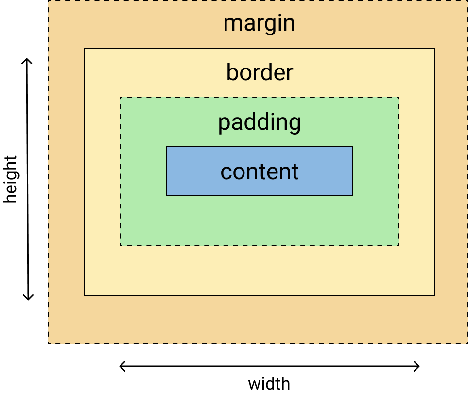
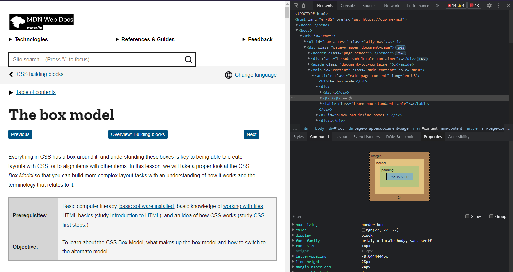
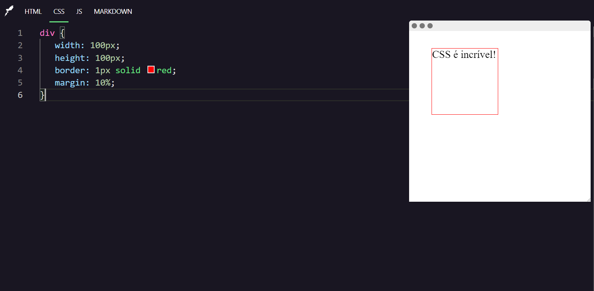
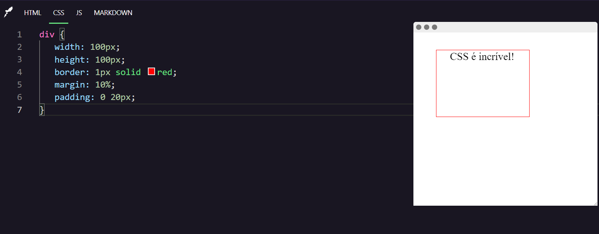
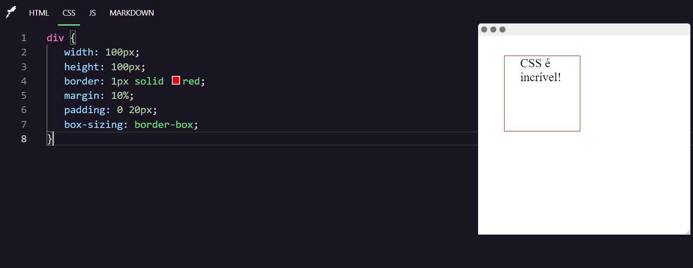
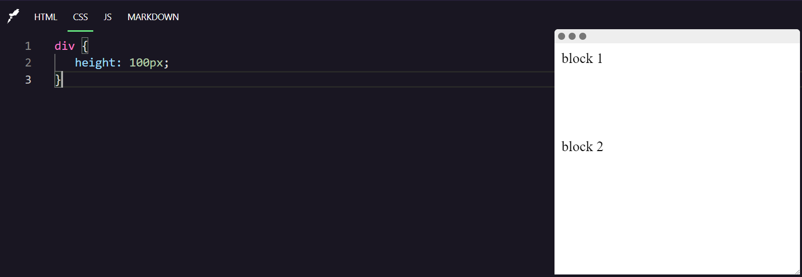
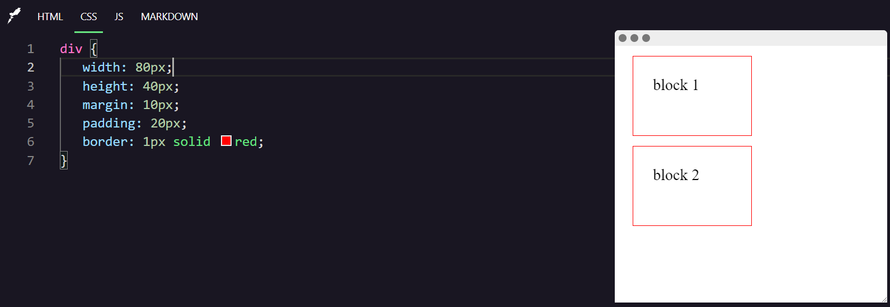
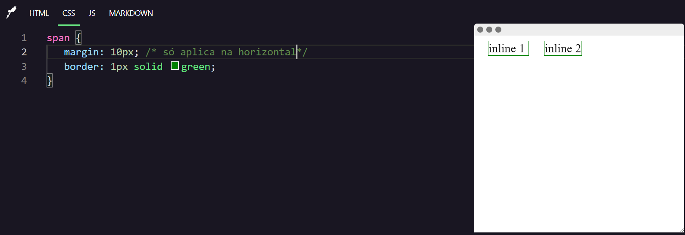

# Uma caixa dentro da outra


O Box Model é fundamental para fazer layouts para web porque ele vai te dar maior facilidade na hora de aplicar o CSS. Ao entender os conceitos do Box Model muitas questões do CSS começam a fazer sentido.

O que é o Box Model?
- Cada elemento é representado como uma caixa retangular
- Essa caixa possui propriedades de uma caixa em 2 dimensões (largura x altura)

Propriedades da caixa
- Tamanho (largura x altura) → width | height
- Conteúdo → content
- Bordas → border
- Preenchimento interno → padding
- Espaços fora da caixa → margin


<br>

## Box Sizing

O box-sizing é o responsável pelo calculo do tamanho total da caixa (box).

Podemos usar a ferramenta de desenvolvedor do próprio navegador para visualizar as especificações dos elementos da página



<br>

💻 Exemplo:

---

HTML:
```
<div>
	CSS é incrível!
</div>
```

CSS:
```
div {
   width: 100px; 
   height: 100px;
   border: 1px solid red;
   margin: 10%;
}
```

Esse é o resultado obtido ao usar o código acima:
<br>



<br>

Quando o padding é adicionado (padding: 0 20px;) faz com que aumente a largura da caixa, deixando de respeitar os 100px de largura:
<br>



<br>

E é por isso que é tão importante conhecer a propriedade do box-sizing.

Por padrão o navegador vai calcular o tamanho da caixa pelo content-box e vai somar com os outros boxes, no exemplo acima no lugar de 100px a caixa vai ficar com uma largura de 140px. Para que isso não aconteça, é possível mudar qual vai ser a referência para o calculo do tamanho da caixa adicionando a propriedade box-sizing: border-box;.

Dessa forma o elemento vai ficar com a largura (width) determinado, que no caso do exemplo citado é de 100px.
<br>



<br>

Normalmente usa-se o código abaixo como forma de "resetar" o box-sizing que vem por padrão nos navegadores.
```
* {
   box-sizing: border-box;
}
```

O seletor * seleciona todos os elementos da página.

<br>

## Display-block-inline


display: block; vs display: inline;

- Como as caixas se comportam em relação as outras caixas
- Comportamento externo das caixas
<br>

## Display Block

- Ocupa toda a linha, colocando o próximo elemento abaixo desse
<br>


<br>

- width e height são respeitados
<br>



<br>

- padding, margin, border irão funcionar normalmente
<br>



<br>


- Exemplos: <p> <div> <section>, todos os headings <h1> <h2>...


<br>

## Display Inline

- Os elementos ficam ao lado do outro e não empurram outros elementos para baixo
<br>


<br>

- width e height não funcionam
<br>


<br>

- Somente valores horizontais de margin
<br>



<br>

- Exemplos: ```<a>``` ```<strong>``` ```<span>``` ```<em>```

<br>

## Margin

Margin, é o espaço (margem) entre os elementos
- Podemos dividir o margin em 4 valores:
- values: ```<length>``` | ```<percentage>``` | auto

Geralmente usamos uma forma abreviada (shorthand) para escrever o margin. Esse formato segue o sentido horário iniciando pelo top, seguindo para right, bottom e left.
```
margin: 12px 16px 10px 4px; /* TOP = 12px | RIGHT = 16px | BOTTOM = 10px | LEFT = 4px */
margin: 12px 16px 0; /* TOP = 12px | RIGHT = 16px | BOTTOM = 0px | LEFT = 16px */
margin: 8px 16px; /* TOP = 8px | RIGHT = 16px | BOTTOM = 8px | LEFT = 16px */
margin: 8px; /* TOP = 8px | RIGHT = 8px | BOTTOM = 8px | LEFT = 8px */
```
- O margin é aplicado em elementos com display block
- Cuidado com o margin collapsing que é quando o top se junta ao bottom

<br>

## Padding

O padding é o preenchimento interno da caixa.

A propriedade padding pode ser escrita como nos formatos apresentados abaixo:
```
padding-top | padding-right | padding-bottom | padding-left
```

Geralmente usamos uma forma abreviada (shorthand) para escrever o padding. Esse formato segue o sentido horário iniciando pelo top, seguindo para right, bottom e left.
```
padding: 12px 16px 10px 4px; /* TOP = 12px | RIGHT = 16px | BOTTOM = 10px | LEFT = 4px */
padding: 12px 16px 0; /* TOP = 12px | RIGHT = 16px | BOTTOM = 0px | LEFT = 16px */
padding: 8px 16px; /* TOP = 8px | RIGHT = 16px | BOTTOM = 8px | LEFT = 16px */
padding: 8px; /* TOP = 8px | RIGHT = 8px | BOTTOM = 8px | LEFT = 8px */
```

O padding pode ter valores (values) de comprimento (px, em, rem) ou de porcentagem (%)
- O padding poderá causar diferença na largura de um elemento

Obs.: Na aula sobre box-sizing aprendemos como resolver essa diferença na largura do elemento

https://app.rocketseat.com.br/node/uma-caixa-dentro-da-outra/lesson/box-sizing

<br>

## Border-outline

- São as bordas da caixa
- Documentação do MDN: https://developer.mozilla.org/en-US/docs/Web/CSS/border
- value: <border-style> | <border-width> | <border-color>
	- style: solid | dotted | dashed | double | groove | ridge | inset | outset
	- width: <length>
	- color: <color>
```
div {
	/* shorthand */
	border-top: solid 2px; /* top | right | bottom | left */

	/* style */
	border: solid;

	/* width <length> | style */
	border: 2px dotted;

	/* style | color */
	border: outset #f33;

	/* width | style | color */
	border: medium dashed green;

}
```

E o outline?

- O outline é muito semelhante ao border, mas difere em 4 sentidos:
	- Não modifica o tamanho da caixa, pois não é parte do Box Model
	- Poderá ser diferente de retangular
	- Não permite ajuste individuais
	- Mais usado pelo user agent para acessibilidade